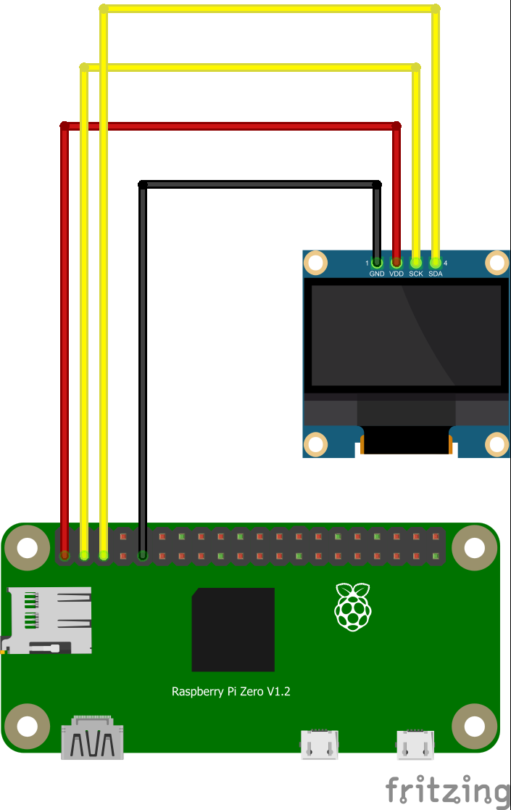

## Raspberry Pi OLED display viewer

#### Pre-requirements :telescope:
You need OLED display 128x64 (other displays are supported with minor tweaks needed) with 4 PINs. I got mine from China.
Subsequently, you need to enable I2C on Raspberry Pi and connect the display as follows. 

For full reference follow [RaspberryPi-Spy](https://www.raspberrypi-spy.co.uk/2018/04/i2c-oled-display-module-with-raspberry-pi/)

#### Requirements :books:
Install requirements from file `requirements.txt` using

    pip install -r requirements.txt
    
 or 
 
    pip3 install -r requirements.txt
    
### Usage :camel:
TBA  